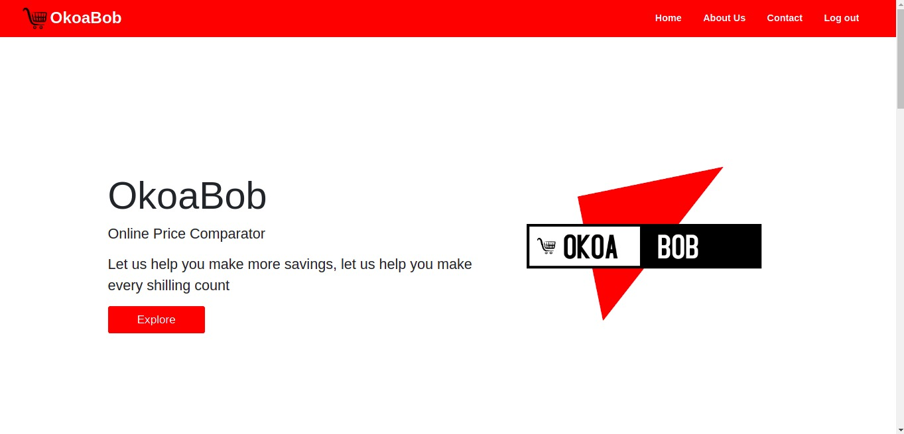

# OKOABOB

## Description

This is a website that helps every common mwananchi with concerns of high cost of living. OkoaBob comes in hand where it will help in terms of telling everyone the nearest location that everyone can buy their needs at a lower price

## Live site

Visit the live site [Here](mugerah.github.io/okoabob/)

## Preview

## Project Setup Instructions

- Open Terminal {Ctrl+Alt+T}
- git clone https://github.com/MugeraH/OkoaBob.git
- cd OkoaBob
- code .(for Vs Code) or atom .(for Atom)

1. Ensure the following stylesheets have also be linked to you project

- [Bootstrap 4](https://maxcdn.bootstrapcdn.com/bootstrap/4.0.0/css/bootstrap.min.css)
- [google Fonts](https://use.fontawesome.com/releases/v5.5.0/css/all.css)

2. Script CDN

- [Javascript](https://ajax.googleapis.com/ajax/libs/jquery/3.5.1/jquery.min.js)

## Technologies Used

1. HTML5
2. CSS
3. BootStrap
4. JavaScript
5. Markdown

## Behaviour Driven Development

| Behavior                                                                                                                                                                                                                                                                                   | input                                                     | output                                                                                                                       |
| ------------------------------------------------------------------------------------------------------------------------------------------------------------------------------------------------------------------------------------------------------------------------------------------ | --------------------------------------------------------- | ---------------------------------------------------------------------------------------------------------------------------- |
| User input selected product from a list of products on submit andis able to compare price list form diffrent retailers| User selects particular product | User sees displayed product list and is notified of least price of product|

## Authors

[Mugera Hughes]

[Bedan Takona]

[Mohamed Amin]

[Oliver Kiplagat]

[Eston Kagwima]

## Contact Information

For any further inquiries or contributions or comments, reach the secretary at [Mugera Hughes https://github.com/]

### License

[MIT License](https://github.com/MugeraH/OkoaBob/blob/main/license) Copyright (c) {2021}
